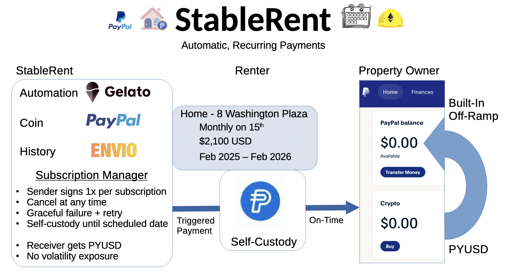

# StableRent Overview

StableRent is a tool for property owners and residents to use Stablecoin digital assets. Property owners can screen tenants by checking account balances of assets and accept Paypal's PYUSD, while residents can automatically send rent payments using stablecoins. 

**🚀 LIVE DEMO:** https://stablerent.vercel.app/

**The Problem We're Solving:**
- The US residential rental market is $291 BILLION dollars
- Estimates for US-based crypto assets are around $90B
- Many folks hear "crypto" and think scam, but Paypal is a reputable company that could ease adoption
- Crypto users want to pay rent in crypto, but finding property owners who take crypto is hard 
- Recurring peer-to-peer transactions (rent, allowance, savings accounts, etc.)

**Discussion in the Industry**: https://www.linkedin.com/posts/shuhaib_crypto-rent-the-100-billion-shift-no-activity-7348397294506975232-thtY/

**Our Solution:**
StableRent enables users to create recurring rental payments using PYUSD (PayPal's stablecoin) through the ERC-20 allowance pattern to auto-off-ramp into the landlord's PayPal account. Landlords can easily withdraw their PYUSD into their fiat Paypal account, without understanding too much of the crypto world, facilitating greater adoption. Money stays in the renter's wallet until payment is due, preserving financial sovereignty. Gelato Network automation monitors rent due dates and automatically triggers payments from Renter's PYUSD -> Landlord's PYUSD PayPal account when due. The crypto ACH. Truly "set and forget" recurring payments. An Envio-powered indexer tracks all payment events to provide a unified dashboard where renters manage their rent payments, view payment history, and receive balance warnings. Landlords can see payment history, as well as run financial qualification searches to check renter's assets. This project will leverage Hardhat's capability to fork mainnet ETH for development. 

**Target Audience:** Crypto-native users who want to pay rent without off-ramping to a traditional bank account.

**Simply:** Recurring direct peer-to-peer crypto payments: **Rent**, Charities, Patreon, child's allowance, etc 



## Hackathon Relevance 
**Why PayPal**: This isn't just catering to PayPal's bounty, PYUSD is actually a good choice for this project: 
- Reputation of PayPal as good company will encourage adoption among crypto-skeptical users
- PYUSD Stablecoin tied to the USD so landlord don't take on volatility risk
- PayPal is an accepted payment source for many other services
- PayPal provides an easy PYUSD to USD off-ramp built into the app for landlords who need USD

**Why Envio**: 
- Rapid multi-chain indexing of renter's addresses to get account balances (on-demand of landlord)
- Tools for tracking subscriptions and on-chain events without centralized database tracking, or slow block parsing

**Why Hardhat**:
- The forking of mainnet ETH is invaluable for testing indexing of account balances
- The simulated blockchain is game-changer for rapid development without faucets or testnets

## 🚀 Current Deployment Status
### Sepolia Contract Deployment
**🔗 Subscription Smart Contract:** [0x278dD89e80B01772affcC8cAEa6e45fFF8Ae3339](https://sepolia.etherscan.io/address/0x278dD89e80B01772affcC8cAEa6e45fFF8Ae3339)  

### Frontend Demo
**Frontend:** [StableRent](https://stablerent.vercel.app/)

### Backend + Database
**Railway** [stablerent-backend](https://backend-production-a05e.up.railway.app)
**Envio** [Envio endpoint](https://indexer.dev.hyperindex.xyz/02074d1/v1/graphql)

### 🎯 **How to Test**
1. Visit the live demo [StableRent](https://stablerent.vercel.app/)
2. Connect MetaMask wallet (Sepolia network)
3. Get test PYUSD from [faucet](https://cloud.google.com/application/web3/faucet/ethereum/sepolia/pyusd)
4. Get test ETH for signing the approval [faucet](https://cloud.google.com/application/web3/faucet/ethereum/sepolia)
5. Create subscription and test payments

---
## Business Plans 


## Potential Path Forward

-> Investigate need for Money Transmitter License 
-> Integrate a sender-side DEX to accept any ERC20 currency
-> Consider a receiver-side DEX to send any ERC20 currency
-> Decide on a business model, build a team, to the moon 🚀 

## MIT License. Like what you See? 
Open source but starving. Donate to the builder. 

PYUSD on ETH: 
```
0xC24DAA2FcBb102f5Ac711E2Da09010382de9d2B8
```
(Other currency wallets listed below.)

## 🚀 Quick Start
### First Time Setup

Run the automated setup script to install dependencies and configure your environment:

```bash
./setup.sh
```

The script will:
- ✓ Check Node.js version (requires LTS: 22.x, 20.x, or 18.x)
- ✓ Create `.env` file (you'll need to add your Alchemy API key)
- ✓ Install all Hardhat and project dependencies
- ✓ Compile contracts
- ✓ Verify setup

**After running setup.sh:**
1. Get free Alchemy API key from https://www.alchemy.com/
2. Add it to your `.env` file
3. Run `npx hardhat test` to verify everything works

### Local Development (Testing Frontend + Backend + Contracts)

**One command to rule them all:**

```bash
./launch.sh
# Options available: frontend, backend, etc.
```

### Sepolia Testnet Deployment (For Hackathon Demo)

Deploying ht main subscription service contract:

```bash
# Quick deployment
npm run deploy:sepolia
```
Deploying the gelato automation contracts:

```bash
npm run deploy:gelato:sepolia
```

Pushing Changes: 
* Enable auto re-deploy on git push in Envio browser 
* Push changes (this will trigger Envio + frontend to rebuild)
* Go back to Envio, disable auto re-deploy, get endpoint URL 
* Change endpoint URL for frontend in variables in browswer (will trigger redeploy) 
* Re-deploy the backend if needed ```cd backend & railway up ```
* Hire a devOps/Automation engineer 

📚 **Complete deployment guide**: [SEPOLIA_DEPLOYMENT_GUIDE.md](./SEPOLIA_DEPLOYMENT_GUIDE.md)  

# StableRent Notes
## Platform Architecture

```
┌─────────────────────────────────────────────────────────────────────┐
│                        StableRent System                            │
└─────────────────────────────────────────────────────────────────────┘

┌─────────────────┐                            ┌──────────────────┐
│  Frontend       │◄───────── REST API ───────►│  Backend         │
│  (React)        │                            │  (Express)       │
├─────────────────┤                            ├──────────────────┤
│• Connect Wallet │                            │• User Profiles   │
│• Create Sub     │                            │• Auth (JWT)      │
│• Approve PYUSD  │                            │• Payment Address │
│• View Dashboard │                            │• Notifications   │
└────────┬────────┘                            └────────┬─────────┘
         │                                              │
         │ Transactions                                 │ Webhooks
         │                                              │
         └──────────┬───────────────────────────────────┘
                    ↓                                   ↑
         ┌──────────────────────────┐                  │
         │   Smart Contracts        │                  │
         │   (Ethereum)             │                  │
         ├──────────────────────────┤                  │
         │• StableRentSubscription  │──── Events ──────┘
         │• PYUSD Token             │          
         │• Gelato Resolver         │          
         │• Gelato Executor         │          
         └──────────┬───────────────┘          
                    │                          
                    │ Events                   
                    ↓                          
         ┌──────────────────────────┐          
         │   Envio Indexer          │          
         │   (Blockchain Events)    │          
         ├──────────────────────────┤          
         │• Tracks all events       │          
         │• GraphQL API             │          
         │• Real-time indexing      │          
         └──────┬──────────┬────────┘          
                │          │                   
      GraphQL   │          │ Webhooks          
                │          │                   
         ┌──────▼──────────▼───────┐           
         │   PostgreSQL Database   │           
         │   (Supabase)             │           
         ├──────────────────────────┤           
         │• User accounts           │           
         │• Subscription metadata   │           
         │• Payment history         │           
         └──────────────────────────┘           

┌─────────────────────────────────────────────────────────────────────┐
│  Backend Automation Service (Self-Hosted)                           │
│  Monitors database → Calls smart contracts → Processes payments     │
│  Runs every 6 hours, handles failures, sends notifications         │
└─────────────────────────────────────────────────────────────────────┘
```

## Note

Cursor + Claude AI was used to support development. 


## Future Considerations:
- Escrow for security deposits, and first/last month
- Lease documents stored on IFPS or Autonomys
- Multi-chain support for broader accessibility (renter holds ZEC -> DEX: NEAR Intents -> PYUSD -> Landlord)
- zkProof or encryption for privacy and security
- StablePay (peer-to-peer)
- StableDonate (Charity focused, recurring donations)
- Proxy pattern for upgradeable contracts
- KYC for transcations over gov reporting limits ($3-5k in single)
- Limits on the allowance approval (is there a regulation limit? what's reasonable?)
- More flexible scheduling options (every 3 weeks, first and fifteenth, etc)
- Internal encrypted messaging system. (Property owner requests of resident to see account balances, resident can approve this requests)
- Gas optimizations on contract (switch to Base, Arbitrium, Polygon)
- PayPal database search (ask for Username -> wallet address)
- Signing transcation could also be first month (not just a sign)
- Automation is currently a cron local -> Gelato or Chainlink for Automation
- Contracts are not yet Verified on Etherscan
- Confusing handling of the .env files (main, frontend, backend, envio.env, hardcoded, browser)

- Listing Resource: 
  - Renters willing to pay rent "I would pay X a month for a 3bed, 2 bath in (zipcode)"
  - Land owners will to rent "I will accept crypto for this rental"
  - For Sale Properties: renter can say "I'd pay X a month for 3 years, if someone bought this and rented it to me."

⚠️ PROTOTYPE DEMONSTRATION
This is a proof-of-concept for educational purposes only.
Not operational. No real financial services provided.
Production launch subject to regulatory approval.

# Like What you See? MIT License
Open source but starving. Donate to the builder. 

ZEC (preferred): 
```
u1s9730x48hwm78q6v6fc9qgwdd46qdkw3lzsvw6ql34sskxhgp82t8xtd7q8j4hsjrhuxglgzj8xdw9llh2qa68alhn59tw72hcjfzu27khep5pktjt077t97t4e529nu8qd88newzvyfhuq37mtjw7jeqqd6y9n8684vmy2me5k30zf5
```
But a dollar is a dollar. 

PYUSD on ETH: 
```
0xC24DAA2FcBb102f5Ac711E2Da09010382de9d2B8
```

ETH:
```
0xcE43a6bEd4bE93DA20fA8F1092Ae3D34662F43b8
```

BTC: 
```
bc1qqul68wynrpr6nhe73ahgsgudvsnyrmx3hzr7cn
```


TODO:
- Fix that envio is not storing transcation hash
- The frontend did not completely fill out the subscription properly with processor information